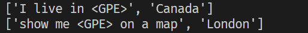
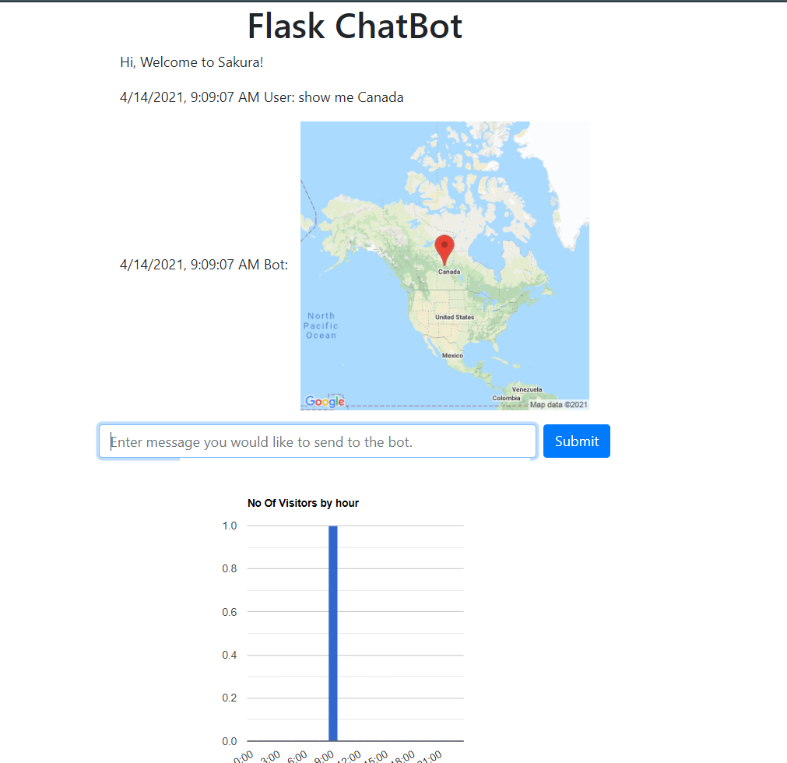
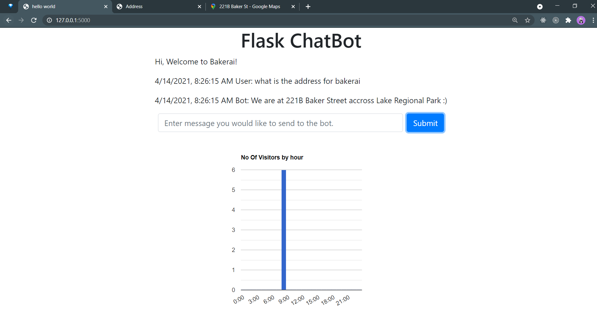
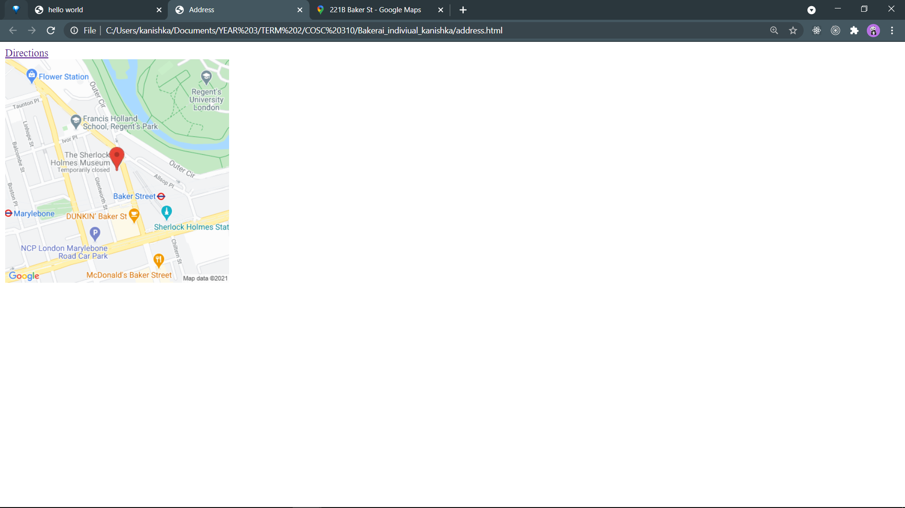
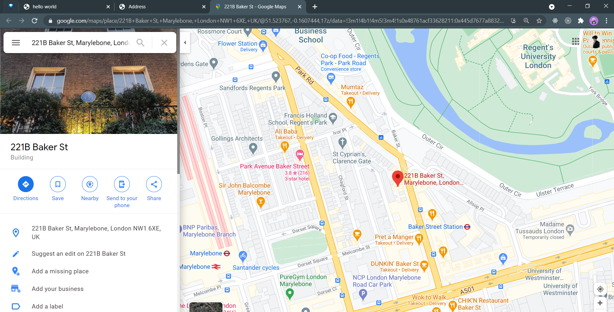
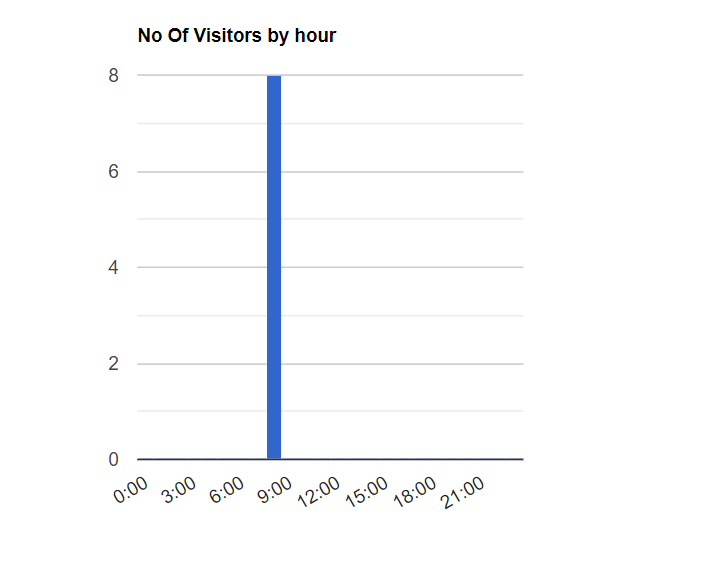

# Features implemented since A3

## Named Entity Recognition

The code of this feature is contained in named_entity_recognition.py. I had to implement this feature before I can use the google map static image API.
What this feature is able to do:
-it takes input text
-finds named entities in the text, specifically locations using spacy python module.  
-then it replaces the entity in the orignal sentence with a \<GPE\> tag
-the text is then fed to the model which then uses intents with \<GPE\> to do specific things.

### screenshots

## Google Static image API

The challenging part with this feature was obtaining the api key, as I was not familar with google could platform. After getting the key, I was able to fetch static map images depending on the location.

The feature has two major usecases in the model:

1. The model is able to respond to sentences like "show me Canada", "show me India" etc. by opening up an image which I was able to fetch from the api and then it opens it in the imageviewer. I was able to get this feature to work as following:

   1. the text goes through NER as described in step 1. Then the model takes in as input strings with \<GPE\> tag in them as described in NER.
   2. the model classifies this response as \<GPE\>. In post processing, I lookout for the GPE tag and then call my method in constant_map_img.py. I was careful to have a seperate file for my api key and did not push it to github.
   3. In the method itself, i make a fetch request to the api with the correct parameters and then write the image to system and display it.

### screenshots

2. The second usecase for the api is as follows:
   previously when asked for the address of the shop, we were only able to return strings saying the address. using the api, I was able to make a new html document called address.html. I was able to embed the google static map image into an image tag and a link in an anchor tag in the html. I then simply open a new window in the user's web-browser, showing the image of the bakery on a map and giving them the link. This provides more context to the user as to the actual location of the bakery rather than just showing a link.

### screenshots

## Flask Integration of the bot

I emailed the proffesor, asking her if it is possible to integrate the bot with a flask app over the web and have it count as a feature. She said it is fine. So, what I did next was make a backend using flask. The backend code can be found in flask_backend.py. I also made a front-end for the app using fetch request, jquery and javascript found under templates/index.html . Overall, this was a huge improvement as rather than running the bot in the terminal, I was able to run it in a web-browser, increasing not only accesibility but also ease of use. This was a very challenging task and required many hours of debugging.

### screenshots

## Google Visualization API

Since I was able to make the bot into a flask application, I thought it might be simple to use the visualization api and display some kind of chart about the store. However, the task was more challenging than I thought. regardless, I was able to do it. The app homepage has a bar chart with hours of the day on the x axis and frequency on the y axis. What the chart displays is how many user's visited the website at a certain hour of the day. To achieve this task, I created a dictionary called frequency on the backend. Whenever, someone made a request to the index page in the backend, I incremented the counter corresponding to the hour at which the request was made. Then I made a new route, so that I can provide said frequency dictionary to the front end. the frontend fetches the dictionary on load using a get request to the /visualize route. After fetching the dictionary, I had to parse it into the exact format which the visualization graph api wanted it in. This was a very challenging task and after a couple of hours, I was able to do it. The result speaks for itself. I make sure to reset the frequency dictionary at 12:00 am everyday.

